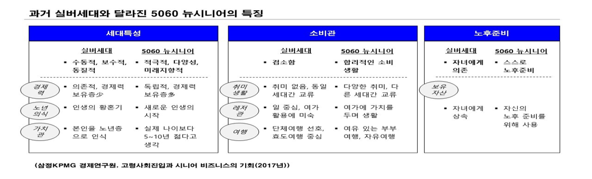
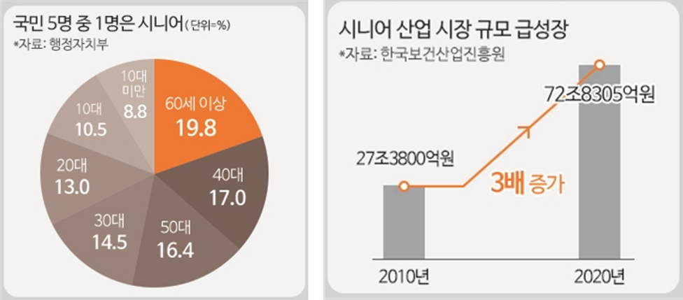

# 뉴 시니어 세대를 위한 백화점 마케팅전략

<aside>
💡 빅데이터 분석 프로젝트
 

 

# 프로젝트 소개

###  📚 프로젝트 주제

- 뉴 시니어 세대를 위한 백화점 마케팅전략

 

### 💭 **배경**

- 과거 실버세대와 달라진 5060 뉴시니어 세대는 여유 있는 자산을 기반으로 자신의 인생을 누리는데 기꺼이 시간과 비용을 투자함.
- 뉴시니어 세대는 소비시장의 새로운 중심으로 성장하고 있음.

 

### ⭐ **목적**

❗ 백화점 구매데이터를 활용하여 뉴시니어 세대를 위한 마케팅 전략을 수집해보자

 

### 💽 데이터수집

- 2014년 롯데백화점 구매데이터(롯데 멤버스)

 

 

---

# 포트폴리오

https://fluttering-laborer-622.notion.site/7522f083875f46d5a1d6d4212591e04d
